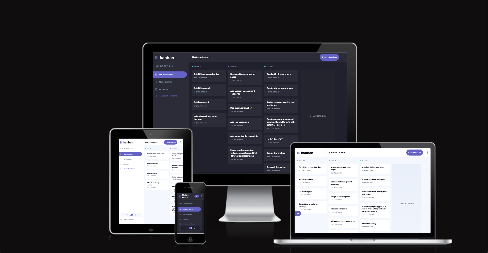

# Frontend Mentor - Kanban task management web app solution

This is a solution to the [Kanban task management web app challenge on Frontend Mentor](https://www.frontendmentor.io/challenges/kanban-task-management-web-app-wgQLt-HlbB). Frontend Mentor challenges help you improve your coding skills by building realistic projects.

## Table of contents

- [Overview](#overview)
  - [The challenge](#the-challenge)
  - [Screenshot](#screenshot)
  - [Links](#links)
- [My process](#my-process)
  - [Built with](#built-with)
  - [What I learned](#what-i-learned)
  - [Continued development](#continued-development)
  - [Useful resources](#useful-resources)
- [Author](#author)
- [Acknowledgments](#acknowledgments)

## Overview

### The challenge

Users should be able to:

- View the optimal layout for the app depending on their device's screen size
- See hover states for all interactive elements on the page
- Create, read, update, and delete boards and tasks
- Receive form validations when trying to create/edit boards and tasks
- Mark subtasks as complete and move tasks between columns
- Hide/show the board sidebar
- Toggle the theme between light/dark modes
- **Bonus**: Allow users to drag and drop tasks to change their status and re-order them in a column
- **Bonus**: Keep track of any changes, even after refreshing the browser (`localStorage` could be used for this if you're not building out a full-stack app)
- **Bonus**: Build this project as a full-stack application

### Links

- Solution URL: [Check out my solution](https://github.com/OliverCadman/kanban_task_management)
- Live Site URL: [Check out my live site](https://olivercadman.github.io/kanban_task_management/)

## My process

### Built with

- Semantic HTML5 markup
- SASS/SCSS
- Mobile-first workflow
- [React](https://reactjs.org/) - JS library
- [FramerMotion](https://www.framer.com/motion/transition/) - For animations
- [DnDToolkit](https://dndkit.com/) - For drag and drop functionality

### What I learned

This project was pretty challenging! I'm glad to have learned more about JavaScript techniques, and more about the React ecosystem in general.

Some things which I particularly enjoyed learning and exploring:

- Managing complex state
- Recursive strategies for updating and finding deeply nested objects
- Working with the Context API
- Implementing a dark/light mode solution

### Continued development

I must admit, my light/dark mode solution doesn't seem too pretty or maintainable. I essentially created two identical CSS variables for each element on the page. One version of the variable would be within a class name for dark mode, and the other in the light mode, and the values of each identical variable would change according to dark or light mode. I'm certain there is a more efficient and maintainable solution for this, which I am keen to explore.

I am also currently building a backend for this application using Flask and MongoDB in a Docker container, adopting a TDD approach to ensure that data mutations are accurate and produce expected results. The backend is nearly finished; I have created an authentication flow using JWT. I am now tackling restructuring how the board state is handled, since I of course will no longer be using the provided data.js file. Right now this feels like quite a significant undertaking! I wanted to wait until I completed the project as a full stack application before I submitted to Frontend Mentor, but I will keep you posted on the progress of the full stack version if you're interested!

### Useful resources

- [NetNinja](https://www.youtube.com/@NetNinja) - NetNinja helped me get a better idea of how to use SASS effectively, to create utility classes and add mixins.

## Author

- Website - [Oliver Cadman](https://www.linkedin.com/in/oliver-cadman/)
- Frontend Mentor - [@OliverCadman](https://www.frontendmentor.io/profile/OliverCadman)

## Acknowledgments

Many thanks to [john-coderpro](https://github.com/john-coderpro), who unknowingly helped me navigate some tricky parts of the project in it's inception!
